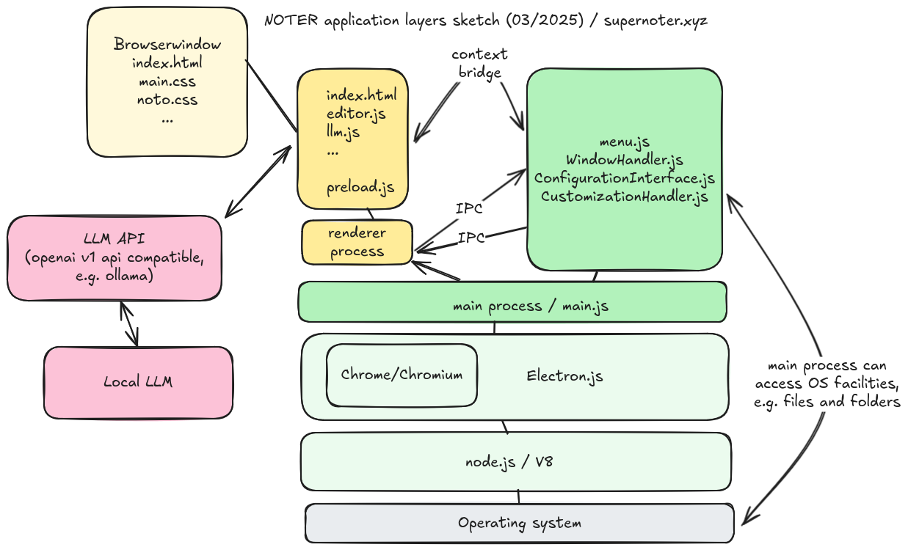

# Noter

NOTER is an open source, minimalistic, themeable markdown editor that seamlessly
integrates with [large-language models](https://en.wikipedia.org/wiki/Large_language_model) (LLM). If you happen to run [ollama](https://ollama.com)
locally, NOTER will automatically connect to the instance. It is currently in
[beta](https://en.wikipedia.org/wiki/Software_release_life_cycle#Beta) stage: you can download it, run it and use it, but some functionality may
be incomplete or missing.

Learn more at [supernoter.xyz](https://supernoter.xyz).


## Install

You can download the [latest release from
GitHub](https://github.com/supernoter/noter/releases/latest). We provide
packages for MacOS, Windows and various Linux distributions.

> Note that we currently do not sign the MacOS and Windows binaries and that
> you may need to pass security warnings in order to run the application.

## Development

NOTER is an [Electron](https://www.electronjs.org/) application. You can build,
test and run the application after you have cloned the repo.

```
$ git clone https://github.com/supernoter/noter.git
$ cd noter/src
$ npm install --include=dev
$ npm run start
```

We provide a basic
[Makefile](https://github.com/supernoter/noter/blob/main/src/Makefile) with
common tasks for the projects, in addition to the usual scripts section in the
[package.json](https://github.com/supernoter/noter/blob/main/src/package.json).

Some example tasks would be, running tests:

```
$ make test
```

Or building packages:

```
$ make build
```

More on setup and development in the [src/README.md](src/).

## Architecture


