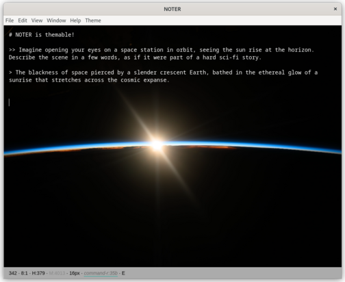

# About

NOTER is an [open source](https://github.com/supernoter/noter), minimalistic,
themable markdown editor that seamlessly integrates with large-language models.
If you happen to run [ollama](https://ollama.com/) locally, NOTER will
automatically connect to the instance. It is currently in
[beta](https://en.wikipedia.org/wiki/Software_release_life_cycle#Beta) stage:
you can download it, run it and use it, but some functionality may be
incomplete or missing.

# Installation

NOTER is available for MacOS, Windows and Linux (deb, rpm, AppImage) - you can
download it from our [releases
page](https://github.com/supernoter/noter/releases/latest).

Note that we currently do not sign the MacOS and Windows binaries and that you
may need to pass security warnings in order to run the application.

# Features

* edit **markdown** and **preview** rendered markdown
* custom **theme** configuration
* export markdown notes directly to good looking **PDF**
* **navigate your notes** (in a default notes folder) quickly with sidebar and filename filter
* seamless integration with open source large language models, such as provided by [ollama](https://ollama.com)
* informative **status bar** shows live character count and more
* load and save **any text** document
* inline **help**

# Demo

<div class="video-container">
  <video loop muted autoplay playsinline preload="auto" poster="/static/intro-fast.jpg" id="intro">
    <source src="/static/intro-fast.webm" type="video/webm" />
    <source src="/static/intro-fast.mp4" type="video/mp4" />
    <source src="/static/intro-fast.ogg" type="video/ogg" />
  </video>
</div>

# Screenshots




# Reference

Access help within the editor with CTRL-h or F1.

## Keyboard Shortcuts

| Keyboard Shortcut | Functionality                                                   |
|-------------------|-----------------------------------------------------------------|
| CTRL-e            | Export note to PDF                                              |
| CTRL-b            | Toggle sidebar                                                  |
| CTRL-g            | Call out to the configured LLM and insert response to a prompt. |
| CTRL-h, F1        | Toggle help                                                     |
| CTRL-n            | Create a new file                                               |
| CTRL-o            | Open an existing file                                           |
| CTRL-p            | Toggle preview                                                  |
| CTRL-s            | Save file                                                       |
| CTRL-+            | Increase font size                                              |
| CTRL-- (minus)    | Decreate font size                                              |

## Configuration

You can customize the editor in many ways, using a
[config.json](https://supernoter.xyz/config.json) file located in standard
locations for different platforms:

* [%APPDATA%](https://superuser.com/questions/632891/what-is-appdata) on Windows
* [$XDG_CONFIG_HOME](https://wiki.archlinux.org/title/XDG_Base_Directory) or ~/.config on Linux
* `~/Library/Application Support/noter` on MacOS

Changes are applied at editor startup time. Below is an example config file:

```json
{
  "window": {
    "opacity": 1,
    "width": 900,
    "height": 550
  },
  "font": {
    "colour": "blue",
    "size": "16px",
    "family": "monospace, monospace"
  },
  "background": {
    "colour": "white",
    "gradient": null,
    "image": null,
    "opacity": "100%"
  },
  "status-bar": {
    "font": {
      "colour": "black",
      "size": "14px",
      "family": "Arial"
    },
    "background": {
      "colour": "white"
    }
  },
  "preview": {
    "font": {
      "colour": "black",
      "size": "20px",
      "family": "Arial"
    },
    "background": {
      "colour": "blue"
    }
  },
  "ollama_host": "http://localhost:11434",
  "ollama_model_name": "gemma"
}
```

# Development notes

We compiled a [Git tutorial](git-tutorial.html) to get started with version control.
