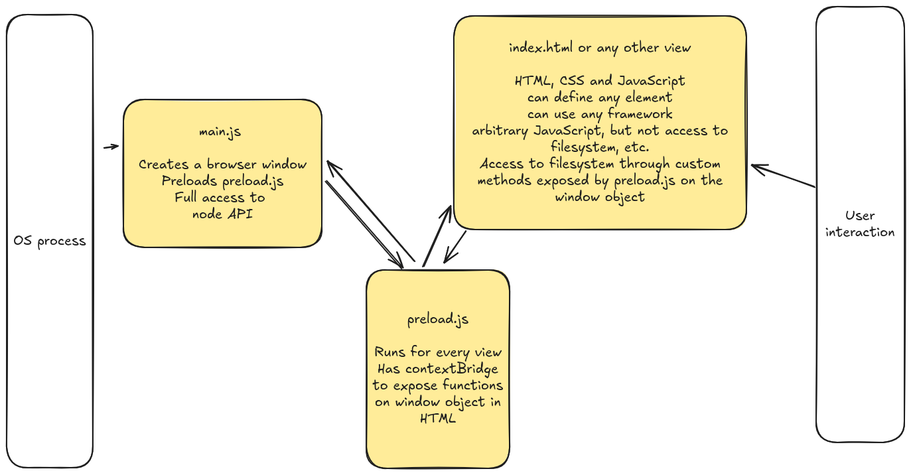
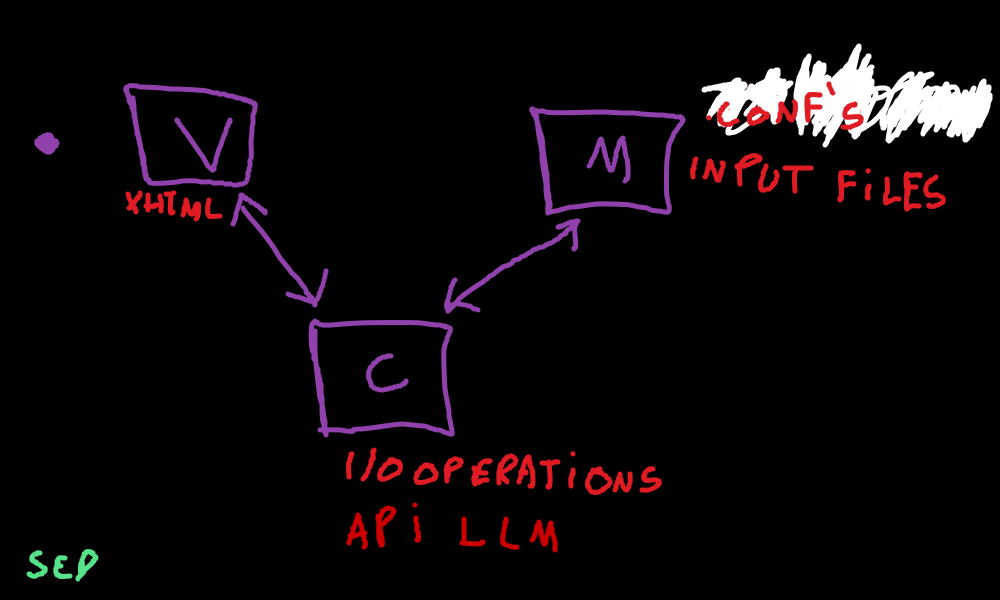

# Architecture

NOTER is an Electron.js application.

We work with a basic `textarea` that is the user input and try to realize a lot
of functionality through a few keyboard shortcuts, e.g.

* CTRL-p for preview (HTML preview of markdown note)
* CTRL-g for generate (with LLM)

A few architectural questions:

* the `contextBridge` will be the exchange point for functionality between the OS and the UI
* in `preload.js` we could start to abstract some of the functionality into separate classes
* in `index.html` we could look into web framework, etc.

## Settings architecture

Settings from a JSON file, loaded into a config object, that should be
accessible from the parts of the application that need it.

